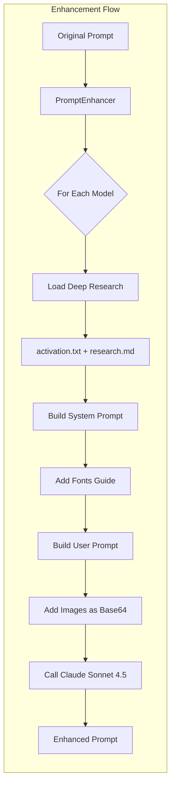
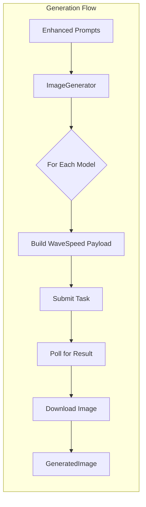
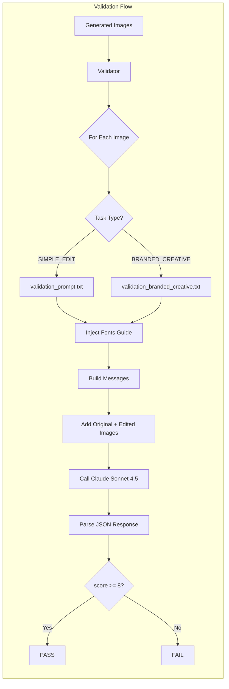
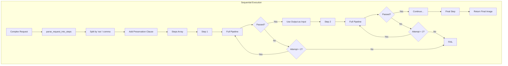
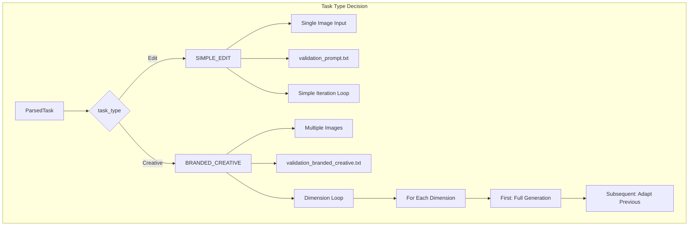
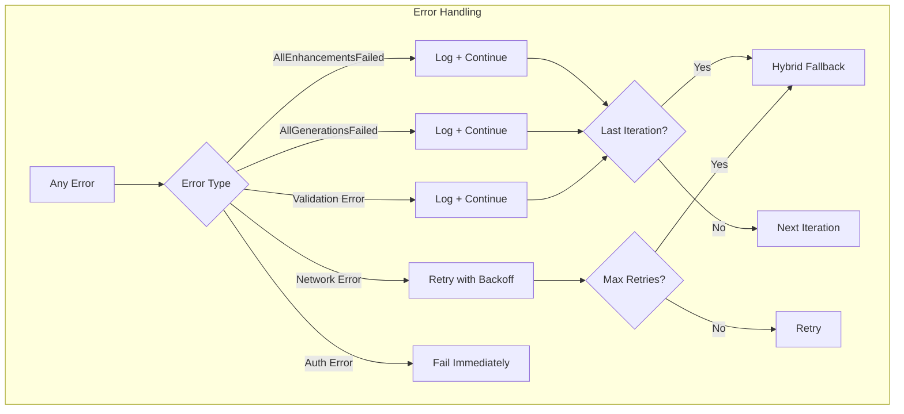
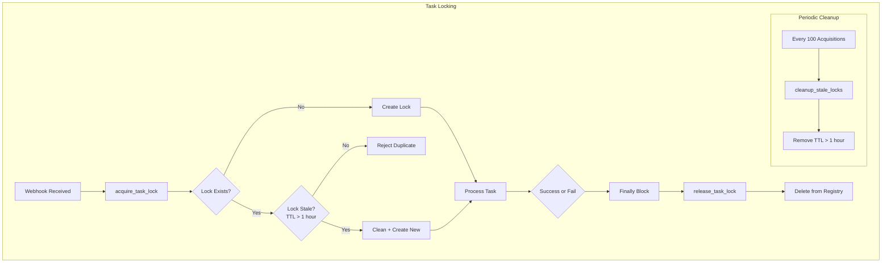

# Image Editing Pipeline - Complete Flow Diagram

## High-Level Architecture

```mermaid
graph TD
    subgraph "Entry Point"
        A[ClickUp Webhook<br/>webhooks.py:319] -->|taskUpdated event| B{Signature Valid?}
        B -->|No| C[401 Unauthorized]
        B -->|Yes| D{Task Lock<br/>Available?}
        D -->|No| E[Already Processing]
        D -->|Yes| F[Acquire Lock]
    end

    subgraph "Task Validation"
        F --> G[Fetch Task from ClickUp]
        G --> H{Status = 'to do'?}
        H -->|No| I[Ignore - Wrong Status]
        H -->|Yes| J{AI Edit<br/>Checkbox?}
        J -->|No| K[Ignore - Not AI Task]
        J -->|Yes| L[TaskParser.parse]
    end

    subgraph "Task Parsing"
        L --> M[Extract Custom Fields]
        M --> N{Task Type?}
        N -->|Edit| O[SIMPLE_EDIT Flow]
        N -->|Creative| P[BRANDED_CREATIVE Flow]
    end

    subgraph "Attachment Processing"
        O --> Q[Download Attachments]
        P --> Q
        Q --> R[Convert to PNG]
        R --> S[Upload to ClickUp]
        S --> T[Get URLs]
    end

    subgraph "Brand Analysis (Optional)"
        T --> U{Brand Website<br/>Provided?}
        U -->|Yes| V[BrandAnalyzer.analyze]
        V --> W[Claude + Web Search]
        W --> X[Extract Brand Aesthetic]
        U -->|No| Y[Skip]
        X --> Z[Continue to Orchestrator]
        Y --> Z
    end

    subgraph "Main Processing"
        Z --> AA[Orchestrator.process_with_iterations]
    end

    subgraph "Iteration Loop (max 3)"
        AA --> AB[PHASE 1: Enhancement]
        AB --> AC[PromptEnhancer.enhance_all_parallel]
        AC --> AD[Claude Sonnet 4.5<br/>+ Deep Research<br/>+ Fonts Guide]
        
        AD --> AE[PHASE 2: Generation]
        AE --> AF[ImageGenerator.generate_all_parallel]
        AF --> AG[WaveSpeed API<br/>nano-banana-pro-edit]
        
        AG --> AH[PHASE 3: Validation]
        AH --> AI[Validator.validate_all_parallel]
        AI --> AJ[Claude Sonnet 4.5<br/>+ Validation Prompt]
        
        AJ --> AK{Score >= 8?}
        AK -->|Yes| AL[SUCCESS!]
        AK -->|No| AM{Iteration < 3?}
        AM -->|Yes| AN[PHASE 5: Refinement]
        AN --> AO[Refiner.refine_with_feedback]
        AO --> AB
        AM -->|No| AP{Can Break Down?}
    end

    subgraph "Sequential Mode"
        AP -->|Yes| AQ[Parse into Steps]
        AQ --> AR[Execute Sequential]
        AR --> AS[Step 1: Enhance → Generate → Validate]
        AS --> AT{Step Passed?}
        AT -->|Yes| AU[Step 2...]
        AT -->|No| AV{Attempt < 2?}
        AV -->|Yes| AS
        AV -->|No| AW[Sequential Failed]
        AU --> AX[Final Step]
        AX --> AY{All Passed?}
        AY -->|Yes| AL
        AY -->|No| AW
    end

    subgraph "Hybrid Fallback"
        AP -->|No| AZ[HybridFallback.trigger_human_review]
        AW --> AZ
        AZ --> BA[Update ClickUp Status = 'blocked']
        BA --> BB[Add Comment with Issues]
    end

    subgraph "Success Path"
        AL --> BC[Upload Final Image]
        BC --> BD[Update Status = 'complete']
        BD --> BE[Add Success Comment]
    end

    subgraph "Cleanup"
        BE --> BF[Uncheck AI Edit Checkbox]
        BB --> BF
        BF --> BG[Release Task Lock]
    end
```

## Detailed Phase Breakdown

### PHASE 1: Prompt Enhancement

### PHASE 2: Image Generation

### PHASE 3: Validation

### Sequential Mode Detail

## Task Type Routing

## Error Handling Flow

## Lock Management

